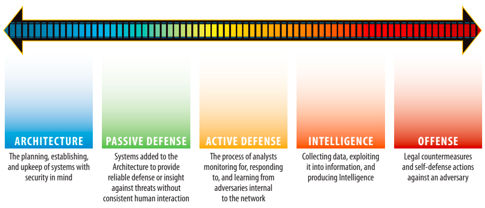
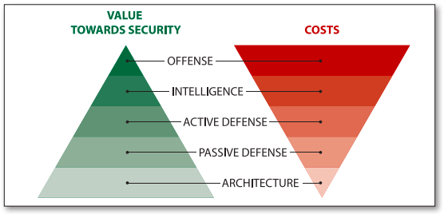

## Principles

[Rob Joyce](https://en.wikipedia.org/wiki/Rob_Joyce) is an American cybersecurity official who served as special assistant to the President and Cybersecurity Coordinator on the U.S. National Security Council.
He served at the NSA for 25 years.
> *If you really want to protect your network, you really have to know your network. You have to know the devices, the security technologies, and the things inside it.*

## Concepts

### The Sliding Scale of Cyber Security

#### Architecture

Architecture refers to the planning, establishing, and upkeep of systems with security in mind.
Here are some example of Architectural controls:

- Perform network segmentation
- Perform vulnerability management and make sure that you don't have missing patches with publicly available exploits
- Following vendor and well known guidelines on systems configuration such as CIS Benchmark and DISA STIGs
- Avoid default passwords

Architecture is mainly driven by processes through guidelines and best practises and people that design, implement and maintain them.
The tools used within this phases are deployed within most organisations, even SMB.

The architecture part is usually performed within each *Architect Team*. For instance, a Cloud Architect or a Network Architect should also make sure that their proposed solution should have been designed with security in mind.

From my perspective, I like to associated this category with the 6 basic security controls within the [CIS Controls](https://www.cisecurity.org/controls/) which are:

- Inventory and Control of Hardware Assets
- Inventory and Control of Software Assets
- Continuous Vulnerability Management
- Controlled Use of Administrative Privileges
- Secure Configuration for Hardware and Softwares on Mobile Devices, Laptops, Workstations and Servers
- Maintenance, Monitoring of Audit logs

Those are the *low-hanging fruit* for any attackers.

This don't look to be the *next-gen*, *AI based* security solution that *YOU NEED TO HAVE*, but you can go quite in depth within this area. Here are some examples:

- Centralized managed host based firewall: it can prevents some attacks, creates logs (cc [n°1](https://medium.com/@cryps1s/endpoint-isolation-with-the-windows-firewall-462a795f4cfb), [n°2](https://docs.microsoft.com/en-us/previous-versions/windows/it-pro/windows-server-2012-r2-and-2012/jj721531(v=ws.11)))
- Perform port isolation through Private VLANs
- Apply security hardenings at applications level on application such as Browsers (cc [CIS Benchmark for Google Chrome](https://www.cisecurity.org/benchmark/google_chrome/), [CIS Benchmark for Mozilla Firefox](https://www.cisecurity.org/benchmark/mozilla_firefox/), ... ), Office suites, ...
- Application whitelisting with AppLocker, Linux IMA, SELinux
- Using group managed service accounts (gMSAs) for SPN within Windows environments.

As this is the area where the ROI is the most effective, I would make sure to get the most of it.
The more you will invest in this area, the less you may add extra solutions which always come with a TCO.

#### Passive Defense

Passive Defenses is on top of a good Architecture to secure systems in the presence of an adversary
At this stage, systems are added to the architecture to provide consistent protection against or insight into threats without constant human interaction.

Here are some example of Passive Defense controls:

- Using security protection at strategical attack surface such as Web and Mail through Web and Mail Secure Gateway
- Deploying endpoint security solutions surch as Endpoint Plalform Protection and/or Endpoint Detection & Response
- Using Network Intrusion Detection/Prevention Systems, Web Application Firewalls

The Passive Defense part is usually performed by engineers that have a focus on security within their field, for instance Network Security engineers are engineers that may have a smaller level of expertise in network compared to network engineers, but can implement and maintain Web Secure Gateway, Intrusion Prevention Systems, ...

Note that you don't always need to invest in a commercial solution. There are tons of OpenSource and/or free solutions that you could leverage such as [Suricata](https://suricata-ids.org/), [ClamAV](https://www.clamav.net/), [Wazuh](https://wazuh.com/), [ntop](https://www.ntop.org/), [Zeek](https://zeek.org/),[OWASP ModSecurity Core Rule Set](https://owasp.org/www-project-modsecurity-core-rule-set/), [SonarQube](https://www.sonarqube.org/), ...

#### Active Defense

Active Defense is the process of analysts monitoring for, responding to, learning from, and applying their knowledge to threats internal to the network.
We find people that respond to indicators of threats that have not been stopped, those people need to analyse, find the root cause and have a plan to contain the threat.

The Active Defense will not deploy controls but will rather focus on fine-tuning them such as SIEM use-cases, WAF rules, IPS rules, ...

The Active Defense part is usually performed by analysts that have strong analyctical skills in order to detect true positives and then use visuals tools, as well as CLI tools to find the root causes of the security incidents and proceed to the eradication of it.

#### Intelligence Defense

Intelligence Defense is the process of collecting data, exploiting it into information, and producing an assessment that satisfies a previously identified knowledge gap.

Threat Intelligence is a specific type of Intelligence that seeks to give defenders
knowledge of the adversary, their actions within the defender’s environment, and
their capabilities as well as their tactics, techniques, and procedures

Intelligence can come from multiple sources:

- Data and information from systems that have been compromised by adversaries in their networks or other networks to derive intelligence about threats they are facing.
- Standing up honeypots to analyze attacks against it are gathering information an analyzing it to create intelligence about adversaries without engaging in an operation against the adversaries

Generating intelligence often requires significant investment of resources, a wide
availability of data collection opportunities, and a singular focus of learning all there is to know about the target. Intelligence consumption though requires analysts be familiar with the environment that the Threat Intelligence is meant for, understand the business operations and technology that can be impacted by it
This means that experience is very expensive.

#### Offense

> / / / To Do

### Time Based Security Model

The time-based security model is a principe that is taking from the book [Time Based Security by Winn Schwartau](https://www.goodreads.com/book/show/604885.Time_Based_Security).

Here are the key components of it:

- **Protection**: It represent the effort (time and difficulty) that it takes for one cyber attack to pass the whole line of preventive mechanisms.
In order to make it harder a cyber attack to achieve his objective, controls such as Security Hardening (STIG/CIS Benchmark), strong Network Segragation, Application Whitelisting, efficient patching of vulnerabilities lifecyle,... needs to be implemented
Within [The Sliding Scale of Cyber Security](https://www.sans.org/reading-room/whitepapers/ActiveDefense/paper/36240), this represent the Architecture and Passive Defense

**Don't forget that attackers have all the time they want, if you are within a sector that highly targetted by advanced cyber crime organizations, it may not be enough**

- **Detection**: It represent after how much time, the company will see the first indicator or precursor of this attack.
This represent the Detection & Analysis stage of the NIST Incident Response Plan
- **Reaction**: How much time it will take to back to *the normal*
This represent the Containment, Eradication & Recovery stage of the NIST Incident Response Plan

## Solutions

### Endpoint Detection & Response

Endpoint Detection & Response are sensors on assets, mostly workstations and servers which does the following things 

- Gather what is happening on the assets in details. Think as a continuous dynamic analysis of what is happening on your system such as:

  - Process Monitoring
  - Windows Registry queries and changes
  - Command Line Interfaces (PowerShell, WMI, Bash, ...)
  - DLL Monitoring
  - Environmental variables changes
  - ...

- Prevent threats from hapenning by blocking high confidence malicious behavior.

- Provides Response capabilites such as:

  - Being able to isolate machines from the environment
  - Being able to rollback a machine towards

- Integrated MSSP (Managed Security Service Provider): Some EDR can propose to have access to Security Analyst which can guide you in case you have some alerts from others sensors and you would like to be assisted to conduct analysis 

#### Architecture

Usually EDRs come with two to three components:

- Agents/Sensors: those are installed on each of your assets in order to send logs to a centrilazed big data infrastructure

- Console: This is where you manage centrally your assets and analyses security incidentes through *Storylines*

#### Considerations

When investing into an Endpoint Detection & Response, you have to consider the following:

- Detection *"level"*: All EDR comes with a lot of detection capabiliites in order to record a maximum of activities that are going on the systems.
Some EDR tends to focus more on the detection capabalities in order to *feed* SIEM systems so that the Security Operation Center can have more visibility over the environments, enabling them to creates additional/better use-cases.
This may be for instance:

  - Advanced binary files metadata capabilities: 
  - Keylogging capabilities:
  - Data Leak Protection capabilities:
  
  This is applicable **if you have, or plan to have a SOC** that will use that additional data within their detection and response processes.
  
  I would strongly recommend to perform already an analysis (if it is not done), of what is currently being sent towards your SIEM/UBA, ...
  
  It may be possible that you already have visibility on some areas due to tools such as:
  - [Sysmon](https://docs.microsoft.com/en-us/sysinternals/downloads/sysmon) which monitor and log system activities.
  - Possible SIEM agents such as [WinLogbeat](https://www.elastic.co/guide/en/beats/winlogbeat/current/_winlogbeat_overview.html)
  - Removable Device Control such as McAfee Device Control, ManageEngine Device Control Plus, Ivanti Device Control, ...
  - Insider Threat Solutions such as Forecpoint Insider Threat, ...

- Threat Hunting capabilities: if you have a SOC with Tier 3 analysts, you may search for an EDR that provides strong Threat Hunting capabalities
This is mostly applicable when you have a very mature SOC with Tier 3 analysts.
For instance, you may want to have:
  - The capability of easily the data with others tools such as Jupyter Notebooks
  - The capability to easily manage your hunting queries
  - ...

### Web Application Firewall

> / / / To Do

### Network Security Monitoring

#### Overview

- **Definition**: Network Security Monitoring **(NSM)** is the collection, analysis, and escalation of indications and warnings to detect and respond to intrusions on computer networks from a **data in motion perspective**
- **Synonym**: Network Traffic Analytics
- **Capabilites**:
  - **Identify**:
    - Through metrics and graphs, you will be able to see:
      - All the systems that are on the network (Asset Discovery)
      - All the network service (Layer-7) and protocols used on the network
      This allows you for instance to be able to know the whole path that some sentive data may be taken. or to detect the use of unencrypted traffic.
  - **Detect**: Some NSM can comes with *Data Centric* capalities in order to detect anomalies based on baseline/profiles.
  - **Prevent**:
  - **Analyse**: As it is a *Data Centric* appliance, it will help you to respond to alerts.
  An signature-based alert will *just* generate an alert with some metadata around it such as a description an a criticality.
  An NSM will allow you to analyse around that alert such as with answer to questions like:
    - Was there unusual network communications with the host that generated that alert ?
    - Is it using a protocol/service that we are supposed to used within that segment ?
    - What other systems have been talking to that asset ?
    - What is the amount of data that has been exchange ?
    - ...
  - **Hunt**: All that data allows you to go look for network communications that could be malicious, but didn't trigger any alert "yet".

Solution includes [Security Onion](https://securityonionsolutions.com/software/)

#### Architecture

> / / / To Do

### Network Intrustion Prevention System

#### Detection

Here are how Network Intrusion Prevention System detects malicious activities

- **Signature-Based Detection**: Is the process of comparing signatures against observed events to identify possible incidents.
Signature-based detection is very effective at detecting **known threats** but largely ineffective at detecting previously unknown threats

- **Anomaly-based detection**: Is the process of comparing definitions of what activity is considered normal against observed events to identify significant deviations.
Here we use a *baseline*, known also has *profile* to identify suspicious behaviors based on statistics.
Lately, vendors has come with names such as *Network Traffic Analytics* or *Network Detection & Response* to express this type of detection, where aditional features are added to enrich the statistics behind it by for instance correlating TLS, DNS metadatas.

- **Stateful Protocol Analysis**

#### Products

Since ages, [Snort](https://www.snort.org/) has been the standard, but now it is moving towards [Suricata](https://suricata-ids.org/)

[Suricata](https://suricata-ids.org/) is a free and open source, mature, fast and robust network threat detection engine.

Here are some reason why people are moving towards Suricata:

- Suricata is **multi-thread**, which is not the case of Snort,
- Suricata comes with a **JA3 integration**, JA3 is used to fingerprint TLS clients.You can even add Ja3 hashes **within signatures** as showed belowed
> alert tls any any -> any any (msg:"match JA3 hash"; ja3.hash; content:"e7eca2baf4458d095b7f45da28c16c34"; sid:100001;)

- Suricata is "Flow" aware, which may play a big part in the performance, when correctly used

#### Considerations

When investing into an Network Intrustion Prevention System, you have to consider the following:

- What type of *Detection* is the tool capable of and we need ?

A way to do this is to use the MITRE ATT&CK [DeTT&CT](https://github.com/rabobank-cdc/DeTTECT/wiki/Getting-started) the visibility coverage and detection coverage you may need.

- If the tool is capable of *Signature-Based Detection*, can it use standard format to implement custom made or receive from the security community ?

You may want to be able to ingest rules that are standard within the industry.
If those rules are widely used, they can be shared within Threat Intelligence Platform and Feeds. You also have more chances to have resources that understand and fine-tune those rules.

- Where will be the sensors placed ?

It may be possible that you want to not only catch attacks in "North-South", but if possible, I would also place IPS in the internal networks at least between critical asset like in front of your Microsoft Active Directory resources.
For instance, they are tons of Zerologon signatures, but they won't be very usefull on the perimeter. 

